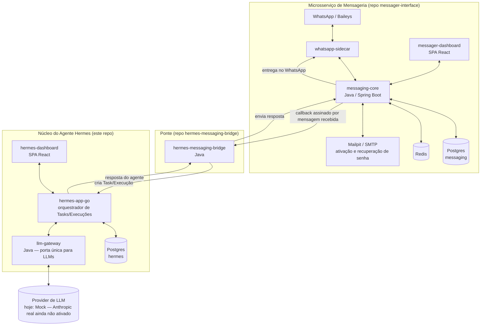
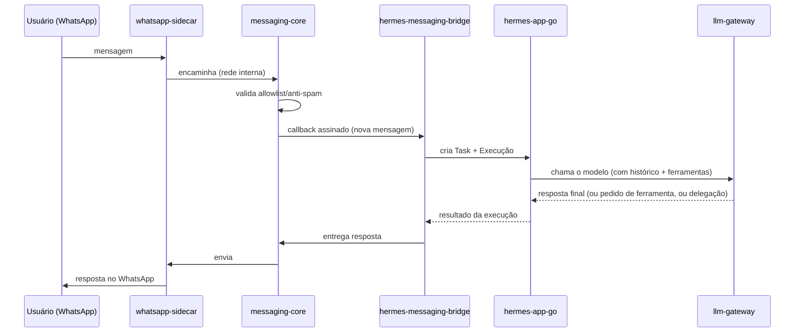

# Hermes — Resumo de Arquitetura

> Documento gerado em 2026-09-23 para compartilhamento externo (sócio). Visão de alto nível,
> não substitui `ARCHITECTURE.md` / `CURRENT_STATE.md` do repositório, que são a fonte de verdade
> técnica e evoluem mais rápido que este resumo.

## O que é o Hermes

Hermes é um agente de IA orientado a tarefas: você cria uma **Task**, o sistema roda uma ou mais
**Execuções** contra um modelo de linguagem, o modelo pode **usar ferramentas** (com um portão de
permissão no meio) e pode **delegar** partes do trabalho para outros agentes especializados. Tudo
fica registrado turno a turno, para auditoria e retomada segura em caso de falha.

Separado disso, e conectado a ele, existe um **microsserviço de mensageria** desacoplado que
permite conversar com o Hermes por WhatsApp (e, por design, outros canais no futuro).

## Visão geral dos componentes

## Núcleo do agente Hermes (`hermes-app-go` + `llm-gateway`)

- **`llm-gateway`** (Java): única porta de saída para qualquer provider de LLM. Nenhum outro
  serviço fala diretamente com um provider — isso mantém a troca de modelo/provider isolada num
  único lugar, e evita que chaves de API circulem pelo resto do sistema.
- **`hermes-app-go`** (Go): o orquestrador. Responsável por:
  - **Tasks e Execuções**: uma Task pode gerar várias Execuções (tentativas/retomadas);
  - **Fila durável em Postgres** (`execution_jobs`): claim atômico, lease, reprocessamento seguro
    de jobs órfãos (sem duplicar efeitos colaterais);
  - **Loop de ferramentas automático**: o modelo pode pedir para usar uma ferramenta durante a
    execução (limite de 8 chamadas por execução, trava de segurança contra loop infinito);
  - **Portão de permissão** (`PermissionPolicy`): toda ferramenta é classificada por risco
    (baixo/moderado/alto); ferramentas de risco moderado ou alto exigem aprovação humana antes de
    rodar — um agente nunca decide sozinho sua própria autorização;
  - **Delegação entre agentes** (`delegate_to_agent`): um agente pode abrir uma sub-tarefa para
    outro agente especializado, com profundidade máxima de delegação (3 níveis) para evitar
    cadeias descontroladas;
  - **Ledger de execução** (`execution_turns`): cada turno (chamada ao modelo, uso de ferramenta,
    delegação) fica registrado com uma chave de idempotência, permitindo retomar uma execução
    interrompida sem repetir efeitos colaterais já concluídos;
  - **Suspensão/retomada genérica**: a execução pausa esperando aprovação humana ou conclusão de
    uma sub-tarefa, e retoma automaticamente quando o evento acontece — nunca por polling.
- **`hermes-dashboard`** (SPA React/Vite): interface própria para acompanhar Tasks, ver o trace
  turno a turno de uma execução, fila de aprovações pendentes e a árvore de delegação entre
  agentes.

**Estado atual do provider de LLM real**: por decisão consciente, o `AnthropicProvider` ainda
responde de forma simplificada (sem repassar o protocolo de tool-use nativo da Anthropic); todo o
loop de ferramentas foi validado contra um provider simulado (`MockProvider`) determinístico.
Ativar o provider real de ponta a ponta é o próximo passo natural, não uma pendência esquecida.

**Gap conhecido e assumido**: `hermes-app-go` hoje não tem autenticação nenhuma na API (diferente
da mensageria, que tem OAuth2 completo). Funciona bem em ambiente local/controlado; expor além
disso exige um gate de autenticação mínimo antes.

## Microsserviço de mensageria (repo `messager-interface`, desacoplado)

Propositalmente um sistema separado — o Hermes não sabe nada sobre WhatsApp, e a mensageria não
sabe nada sobre agentes de IA. A ponte entre os dois mundos é o `hermes-messaging-bridge`.

- **`whatsapp-sidecar`**: processo dedicado (Baileys) que mantém a sessão WhatsApp via WebSocket
  e fala com o `messaging-core` por uma rede interna, com token de serviço.
- **`messaging-core`** (Java/Spring Boot): o núcleo do microsserviço — multi-tenant, contatos,
  allowlist/anti-spam, grupos, canais (WhatsApp hoje, Telegram no desenho), callbacks assinados
  para sistemas externos (como o `hermes-messaging-bridge`), e todo o sistema de **login humano
  do dashboard** (ver seção abaixo). Dados em Postgres, cache/rate-limit em Redis.
- **`messager-dashboard`** (SPA React): interface para operar a mensageria — canais, contatos,
  grupos, callbacks — usada pela equipe, não pelos usuários finais do WhatsApp.
- **`hermes-messaging-bridge`** (Java, repo próprio): recebe o callback de mensagem recebida do
  `messaging-core`, cria a Task/Execução correspondente no `hermes-app-go`, e devolve a resposta
  do agente para ser entregue de volta no WhatsApp. É a única peça que conhece os dois lados.

## Login e segurança do dashboard de mensageria

Item que motivou esta rodada de verificação: o sistema de login humano do `messager-dashboard` já
está implementado (não era necessário desenhá-lo do zero) e foi testado ponta a ponta agora:

1. **Senha com salt**: hash via BCrypt (salt embutido, padrão de mercado) — nunca senha em texto
   puro em lugar nenhum.
2. **Link de ativação por email**: convite gera um token de uso único (armazenado como hash
   SHA-256, nunca o token bruto), enviado por email com link `/activate?token=...`; usuário define
   a própria senha na primeira ativação.
3. **Recuperação de senha**: mesmo mecanismo de token de uso único, fluxo `/forgot-password` →
   email → `/reset-password?token=...`.
4. **Dois fatores (TOTP, compatível com Google Authenticator)**: obrigatório no primeiro login;
   segredo TOTP é armazenado **cifrado em repouso** (AES); 8 códigos de recuperação de uso único
   são gerados no enrollment, para o caso de perda do celular/app autenticador.
5. **Sessão**: cookie HttpOnly de refresh (SameSite=Lax) + token de acesso de curta duração
   (15 minutos), com um cabeçalho extra (`X-Dashboard-Request`) como mitigação de CSRF em
   endpoints que usam o cookie.
6. **Proteção contra força bruta**: rate limit de tentativas de login e bloqueio de conta após 5
   falhas (15 minutos).

Testado agora, de ponta a ponta, em ambiente local (convite → ativação → login → configuração do
TOTP → confirmação do código → sessão via refresh): **funcionando integralmente**. Duas coisas
foram corrigidas para isso rodar de verdade neste ambiente (bugs de infraestrutura, não do
desenho do login em si):

- As chaves de criptografia usadas para cifrar credenciais de canal e segredo TOTP precisam ser
  32 bytes em Base64 — estavam geradas no formato errado (hex).
- O serviço de captura de email local (Mailpit, usado só em desenvolvimento) não tinha a porta do
  host publicada corretamente por causa de uma rede Docker marcada como interna.

**Pendência real, não de infraestrutura**: esse código de autenticação (senha, tokens, TOTP,
recuperação) ainda não tem cobertura de testes automatizados. Por ser código sensível a
segurança, é a prioridade recomendada antes de qualquer uso em produção com usuários reais.

## Fluxo de uma mensagem de WhatsApp até o agente e de volta

## Revisão técnica e endurecimento do pipeline (Fase F)

Esta arquitetura foi revisada tecnicamente (pelo sócio) depois da primeira versão deste
documento. A revisão levantou 5 pontos; cada um foi verificado contra o código real e os gaps
confirmados foram fechados:

1. **Executor de ferramentas aplica permissão em código, não no prompt** — já estava correto
   (`InvokeToolUseCase`). Gap real encontrado: nenhuma ferramenta tinha timeout. **Corrigido**:
   toda execução de ferramenta agora é limitada a 30s.
2. **Aprovação vinculada à ação exata (destinatário/conteúdo exatos, uso único, expira)** — já
   estava correto, nada a mudar.
3. **Proteção da passagem mensagem→tarefa** — gaps reais confirmados e corrigidos:
   - **Idempotência por mensagem**: o bridge agora grava cada `messageId` antes de despachar;
     uma reentrega do `messaging-core` (que já retenta de verdade) não cria mais uma tarefa
     duplicada.
   - **Autorização por remetente**: antes, qualquer contato acionava o mesmo agente com as
     mesmas capacidades administrativas. Agora existe um agente `customer` (sem nenhuma
     ferramenta) para quem não está na lista de números do dono/equipe — só esses números
     acessam o agente `general` com capacidades completas.
4. **Persistir antes de confirmar recebimento / outbox de resposta** — gap real confirmado e
   corrigido: o bridge agora grava o evento recebido antes de responder ao callback, e a
   resposta de saída passa por uma fila durável (`outbound_replies`) processada por um worker
   com retry — uma queda entre "execução concluída" e "enviado" não perde mais a resposta. O
   `messaging-core` ganhou uma chave de idempotência de envio (`clientMessageId`) para que um
   retry dessa fila não duplique o envio no WhatsApp.
5. **Bridge enxuta (só tradução e correlação, sem planejamento/autorização)** — confirmado, sem
   ressalvas; nada mudou aqui.

Hardening aplicado após a versão inicial: a API do `hermes-app-go` exige JWT HS256 com
issuer/audience, tenant e scopes; callbacks do bridge usam contrato v2 com timestamp,
`X-Webhook-Id` persistido e tolerância de cinco minutos; e a execução de ferramentas possui
limites de argumentos, resultado, concorrência e timeout. Ainda não há sandbox de sistema
operacional para ferramentas nativas (shell/filesystem), que continuam fora do catálogo seguro.

## Resumo do estado atual

| Área | Status |
|---|---|
| Núcleo do agente (loop de ferramentas, delegação, ledger, retomada) | Implementado e testado |
| Timeout de execução de ferramenta | Implementado e testado (Fase F) |
| Provider real de LLM (Anthropic) | Contrato pronto, ativação de tool-use nativo pendente (decisão consciente) |
| Autenticação do `hermes-app-go` (API do agente) | Implementada — JWT HS256, issuer/audience, tenant e scopes; configuração fail-closed |
| Dashboard próprio do Hermes (`hermes-dashboard`) | Implementado |
| Mensageria (WhatsApp, allowlist, callbacks) | Implementado e testado em produção local (round-trip real) |
| Idempotência de mensagem + outbox de resposta no bridge | Implementado (Fase F) |
| Autorização por remetente (dono vs. cliente) | Implementado (Fase F) |
| Proteção a replay da assinatura do callback | **Implementada no bridge (v2)** — v1 apenas durante migração explícita |
| Login humano do dashboard de mensageria (senha+salt, ativação, recuperação, TOTP) | Implementado e testado ponta a ponta agora |
| Testes automatizados do login humano | Cobertura existente no messaging-core/dashboard; revisão contínua recomendada |
