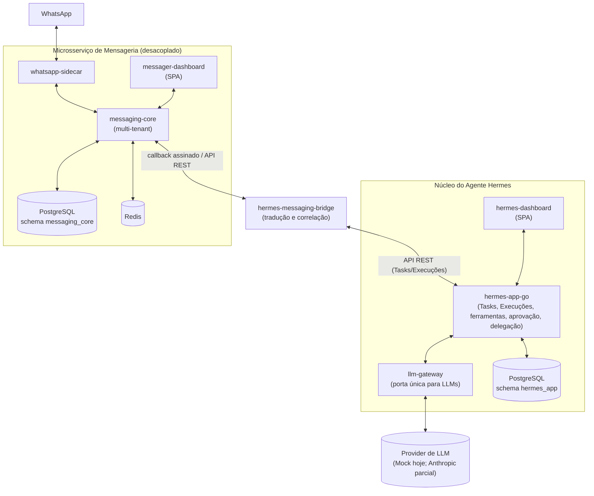
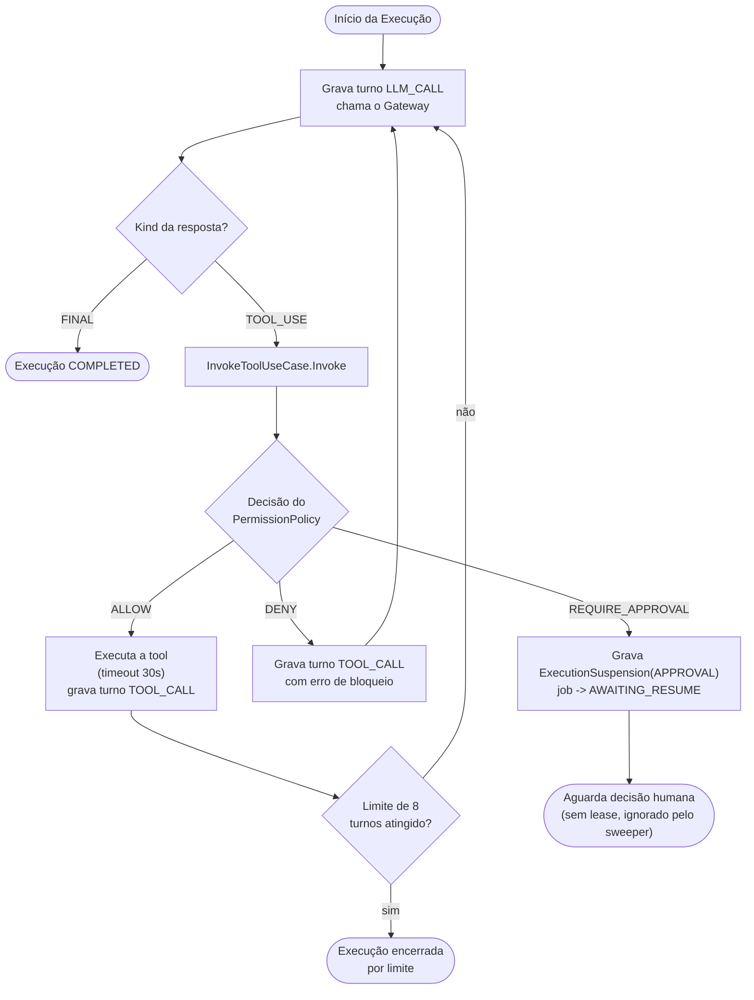
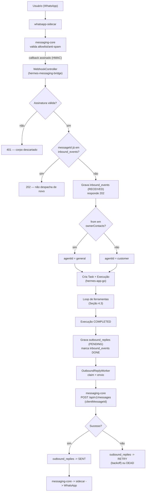

**HERMES**

**Documento Técnico de Arquitetura**

**Versão 1.1**

| **Histórico de Revisões** |            |                                                                                 |              |
|:--------------------------|:-----------|:--------------------------------------------------------------------------------|:-------------|
| **Versão**                 | **Data**   | **Descrição**                                                                   | **Autor**    |
| 1.0                         | 2026-09-24 | Elaboração do documento: núcleo do agente, mensageria desacoplada e Fase F (hardening do pipeline mensagem→tarefa→resposta). | Claude (assistente técnico) |
| 1.1                         | 2026-09-25 | Reorganização em dois repositórios (`hermes` e `messager`); Seção 6.2 atualizada para o contrato de callback v2 (replay); rede de integração movida para um override do lado consumidor. | Claude (assistente técnico) |

---

## Sumário

1. [Introdução](#1-introdução)
2. [Identificação do Projeto](#2-identificação-do-projeto)
3. [Visão Geral da Arquitetura](#3-visão-geral-da-arquitetura)
4. [Núcleo do Agente Hermes](#4-núcleo-do-agente-hermes)
   4.1. [Modelo de domínio: Task, Execution, ExecutionTurn](#41-modelo-de-domínio-task-execution-executionturn)
   4.2. [Gateway único de LLM](#42-gateway-único-de-llm)
   4.3. [Loop automático de uso de ferramentas](#43-loop-automático-de-uso-de-ferramentas)
   4.4. [Execução de ferramentas: permissão aplicada em código](#44-execução-de-ferramentas-permissão-aplicada-em-código)
   4.5. [Aprovação humana vinculada à ação exata](#45-aprovação-humana-vinculada-à-ação-exata)
   4.6. [Delegação entre agentes (multi-agente)](#46-delegação-entre-agentes-multi-agente)
   4.7. [Suspensão e retomada de execução](#47-suspensão-e-retomada-de-execução)
   4.8. [Fila durável de jobs](#48-fila-durável-de-jobs)
   4.9. [Catálogo de agentes e capacidades](#49-catálogo-de-agentes-e-capacidades)
5. [Microsserviço de Mensageria Desacoplado](#5-microsserviço-de-mensageria-desacoplado)
   5.1. [Separação de responsabilidade e multi-tenant](#51-separação-de-responsabilidade-e-multi-tenant)
   5.2. [Canais e adaptadores](#52-canais-e-adaptadores)
   5.3. [Allowlist e anti-spam](#53-allowlist-e-anti-spam)
   5.4. [Fila de envio e idempotência](#54-fila-de-envio-e-idempotência)
   5.5. [Callbacks assinados](#55-callbacks-assinados)
   5.6. [Autenticação humana do dashboard](#56-autenticação-humana-do-dashboard)
6. [Ponte de Integração (hermes-messaging-bridge)](#6-ponte-de-integração-hermes-messaging-bridge)
   6.1. [Responsabilidade única](#61-responsabilidade-única)
   6.2. [Verificação de assinatura](#62-verificação-de-assinatura)
   6.3. [Idempotência de mensagem e persistência antes do ack](#63-idempotência-de-mensagem-e-persistência-antes-do-ack)
   6.4. [Outbox de resposta](#64-outbox-de-resposta)
   6.5. [Autorização por remetente](#65-autorização-por-remetente)
7. [Diagramas Consolidados](#7-diagramas-consolidados)
8. [Decisões Arquiteturais e Riscos Conhecidos](#8-decisões-arquiteturais-e-riscos-conhecidos)
9. [Rastreabilidade e Observabilidade](#9-rastreabilidade-e-observabilidade)
10. [Referências](#10-referências)
11. [Aprovações](#11-aprovações)

---

## 1. Introdução

Este documento descreve, de forma técnica e precisa, a arquitetura implementada até a presente
data (versão 1.0) para o agente Hermes e para o microsserviço de mensageria que o alimenta. O
documento cobre exclusivamente o que está **implementado e testado** no código-fonte dos
repositórios `hermes-app-go`, `llm-gateway`, `messager-interface/messaging-core`,
`hermes-messaging-bridge`, `hermes-dashboard` e `messager-dashboard` — decisões planejadas mas
não implementadas são explicitamente marcadas como tal na Seção 8.

O documento segue a estrutura de controle de versão e revisão do Processo de Gerenciamento de
Projetos (PGP) do MCTI (capa, histórico de revisões, sumário numerado, seção de aprovações),
adaptado para um artefato de arquitetura técnica de software.

## 2. Identificação do Projeto

| Campo | Valor |
|---|---|
| **Projeto** | HERMES — Agente de IA orientado a tarefas, com mensageria desacoplada |
| **Repositórios** | **`hermes`** (produto do agente): `llm-gateway/`, `hermes-app-go/`, `hermes-app/` (legado, referência), `hermes-dashboard/`, `integrations/messaging-bridge/` (adaptador do lado consumidor), `docs/`. **`messager`** (produto de mensageria, independente e sem referência ao Hermes): `messaging-core/`, `whatsapp-sidecar/`, `dashboard/`. A única ligação entre os dois é a ponte e o override de rede `integrations/messaging-bridge/compose.messager-link.yaml`. |
| **Linguagens** | Go 1.x (`hermes-app-go`), Java 21 / Spring Boot 3.4 (`llm-gateway`, `messaging-core`, `hermes-messaging-bridge`), TypeScript/React (`hermes-dashboard`, `messager-dashboard`) |
| **Persistência** | PostgreSQL 17 (um schema/banco por serviço), Redis (cache/rate-limit) |
| **Provider de LLM em uso** | `MockProvider` determinístico (Fases A–F validadas contra ele); `AnthropicProvider` implementado para resposta simples, sem repasse de `tool_use` nativo (ver Seção 8) |

## 3. Visão Geral da Arquitetura

Dois sistemas desacoplados, integrados por uma ponte de tradução:

- **Núcleo do agente** (`hermes-app-go` + `llm-gateway`): dono de Tasks, Execuções, ferramentas,
  aprovações e delegação. Não conhece WhatsApp nem qualquer canal de mensageria.
- **Microsserviço de mensageria** (`messaging-core` + `whatsapp-sidecar`): dono de canais,
  contatos, conversas e entrega de mensagens. Não conhece agentes de IA, tarefas nem LLMs.
- **Ponte** (`hermes-messaging-bridge`): único componente que conhece os dois lados. Traduz
  eventos e correlaciona respostas; deliberadamente não planeja, não guarda histórico de
  negócio e não decide autorização de ferramentas (Seção 6.1).

Cada serviço possui seu próprio banco de dados; nenhum serviço acessa diretamente o schema de
outro. Toda integração é por contrato HTTP (REST) explícito.

## 4. Núcleo do Agente Hermes

### 4.1. Modelo de domínio: Task, Execution, ExecutionTurn

- **Task**: unidade de trabalho solicitada, associada a um `AgentID` do catálogo (Seção 4.9).
  Pode ter um `ParentTaskID` quando criada por delegação (Seção 4.6), com profundidade máxima
  controlada (`MaxDelegationDepth`).
- **Execution**: uma tentativa de execução de uma Task. Uma Task pode ter múltiplas Execuções
  (retomadas após suspensão, retentativas).
- **ExecutionTurn**: registro append-only de cada passo dentro de uma Execução — chamada ao
  modelo (`LLM_CALL`), uso de ferramenta (`TOOL_CALL`) ou delegação (`SUBTASK`). Cada turno tem
  um `RequestID` determinístico (`<executionID>-turn-<N>`), garantindo que uma execução
  reprocessada por falha (job órfão reclamado pelo *sweeper*) nunca repita uma chamada externa já
  concluída para aquele turno.

### 4.2. Gateway único de LLM

O `llm-gateway` (Java) é a única porta de saída para qualquer provider de modelo de linguagem.
Nenhum outro serviço do ecossistema mantém credencial de provider. O contrato
`hermes-app-go` ↔ `llm-gateway` inclui:

- `ChatRequest.Tools []ToolSpec` — ferramentas oferecidas ao modelo nesta chamada.
- `ChatResponse.Kind` — `FINAL` ou `TOOL_USE`; em `TOOL_USE`, `ToolName`/`ArgsJSON`/`ToolUseID`
  identificam a ferramenta solicitada pelo modelo.

### 4.3. Loop automático de uso de ferramentas

`RunAgentLoopUseCase` substitui uma chamada única ao Gateway por um laço limitado a **8 chamadas
por execução** (trava de segurança contra loop infinito):

### 4.4. Execução de ferramentas: permissão aplicada em código

`InvokeToolUseCase.Invoke` é o único caminho que executa uma ferramenta:

1. Resolve o `Executor` da ferramenta e sua `Definition` (nome, `RiskLevel`).
2. Verifica se o agente possui a *capability* correspondente; se não, decisão é `DENY` direto.
3. Se possui, `PermissionPolicy.Evaluate` decide `ALLOW` / `DENY` / `REQUIRE_APPROVAL` — decisão
   tomada **em código**, nunca inferida da instrução do prompt ou da resposta do modelo.
4. O `ToolCall` (registro de auditoria) é persistido **antes** de qualquer execução, com o
   resultado da decisão — não existe lacuna entre "decidido" e "registrado".
5. Somente em `ALLOW` a ferramenta roda, e roda sob `context.WithTimeout` de **30 segundos**
   (`defaultToolExecutionTimeout`) — uma ferramenta travada é interrompida por *deadline*, nunca
   trava a execução indefinidamente.

Limite de CPU/memória/acesso a sistema de arquivos por ferramenta é uma lacuna conhecida e
documentada (Seção 8) — nenhuma ferramenta atual justifica esse framework de contenção.

### 4.5. Aprovação humana vinculada à ação exata

`ApprovalRequest` é criado 1:1 com o `ToolCallID` já persistido com os argumentos exatos da
chamada (`ArgsJSON`). Propriedades garantidas pelo domínio (`domain.ApprovalRequest`):

- **Vinculação exata**: aprovar executa exatamente o `ToolCall` já gravado — não existe
  "aprovação genérica" reaproveitável para uma chamada com argumentos diferentes. Uma nova
  chamada, mesmo com argumentos idênticos, sempre gera seu próprio `ToolCall` e sua própria
  `ApprovalRequest`.
- **Uso único**: `Approve`/`Deny` só transicionam a partir de `PENDING`; uma segunda tentativa de
  decisão sobre a mesma aprovação falha.
- **Expiração**: `ExpiresAt` calculado no momento da criação (`defaultApprovalTTL = 15min`);
  `EffectiveStatus` computa expiração de forma *lazy* (função pura de timestamps armazenados),
  sem depender de um sweeper para "aplicar" a expiração.

### 4.6. Delegação entre agentes (multi-agente)

A ferramenta `delegate_to_agent` (classificada `MODERATE` por padrão, sujeita ao mesmo portão de
aprovação da Seção 4.5) permite que um agente crie uma Task filha (`ParentTaskID` setado),
enfileirada pelo mesmo pipeline completo — incluindo seu próprio loop de ferramentas (Seção 4.3).
A execução pai é suspensa (`ExecutionSuspension{Reason: SUBTASK}`) até a sub-task atingir um
estado terminal, quando é automaticamente retomada com o resultado incorporado como turno.
Profundidade máxima de delegação (`MaxDelegationDepth = 3`) impede cadeias descontroladas.

### 4.7. Suspensão e retomada de execução

Mecanismo genérico compartilhado pelas Seções 4.5 e 4.6: `domain.ExecutionSuspension` registra
`{ExecutionID, Reason (APPROVAL|SUBTASK), ResumeKey}`. O `ExecutionJob` correspondente recebe o
status `AWAITING_RESUME` — deliberadamente **sem lease**, para que o *sweeper* de recuperação de
jobs órfãos o ignore explicitamente (uma execução aguardando decisão humana ou sub-task não é uma
falha a ser reclamada).

### 4.8. Fila durável de jobs

`execution_jobs` (PostgreSQL) implementa fila durável com claim atômico por status: `UPDATE ...
WHERE status IN (...)` resolve a corrida entre workers inteiramente no banco, sem registro de
workers em memória. `MarkRunning`/`MarkDone`/`MarkFailed` são igualmente guardados por status.
Um *sweeper* periódico (`RequeueOrphaned`) recupera jobs com lease expirada via uma lista
explícita de status elegíveis — novos status (como `AWAITING_RESUME`) ficam automaticamente fora
dessa varredura sem necessidade de código adicional.

### 4.9. Catálogo de agentes e capacidades

Catálogo curado (`agentregistry/catalog.yaml`), validado integralmente na inicialização:

| Agente | Capacidades | Uso |
|---|---|---|
| `general` | `current_time`, `echo`, `delegate_to_agent` | Uso interno/administrativo — acesso completo |
| `concise` | (nenhuma) | Respostas terse, mesma finalidade de `general` sem ferramentas |
| `customer` | (nenhuma) | Agente voltado a contatos externos — ver Seção 6.5 |

A posse de uma *capability* é necessária, mas não suficiente: `PermissionPolicy` ainda decide
`ALLOW`/`DENY`/`REQUIRE_APPROVAL` por chamada (Seção 4.4).

## 5. Microsserviço de Mensageria Desacoplado

### 5.1. Separação de responsabilidade e multi-tenant

`messaging-core` (Java/Spring Boot) é multi-tenant desde a base: toda leitura/escrita é
filtrada por `TenantId`, autenticação via OAuth2 `client_credentials`. Não possui nenhuma
dependência do domínio do Hermes (Tasks, Execuções, agentes).

### 5.2. Canais e adaptadores

`whatsapp-sidecar` mantém a sessão WhatsApp (Baileys, WebSocket) isolada em rede própria com
saída à Internet (`messaging_egress`), falando com `messaging-core` por rede interna com token de
serviço. Suporte a múltiplos tipos de canal (`ChannelAdapterRegistry`): WhatsApp, Discord, SMS,
Email, Telegram.

### 5.3. Allowlist e anti-spam

Contatos precisam estar explicitamente permitidos (`Contact.allowed`) para automações de entrada
(`AUTOMATION_INBOUND`) e saída. Limite de mensagens por conversa por minuto e por canal SMS por
hora (`countRecentByConversation`/`countRecentByChannel`) é aplicado no momento do envio.

### 5.4. Fila de envio e idempotência

`OutboundJob` é uma fila durável separada de `OutboundMessage` (que permanece o registro de
auditoria/resultado), mesmo padrão de claim/lease/retry da Seção 4.8. Desde a Fase F,
`POST /api/v1/messages` aceita um `clientMessageId` opcional: uma chamada repetida com a mesma
chave retorna a mensagem já existente em vez de criar uma duplicata — usado pelo outbox do bridge
(Seção 6.4) para tornar o reenvio seguro.

### 5.5. Callbacks assinados

`CallbackSubscription` registra uma URL de callback com um segredo de assinatura próprio.
`RestClientCallbackHttpSender` assina cada entrega com HMAC-SHA256 sobre o corpo bruto
(`X-Signature: sha256=<hex>`). Entregas têm orçamento de retentativa limitado
(`CallbackDeliveryRepository.retryOrDead`).

### 5.6. Autenticação humana do dashboard

Sistema completo e testado ponta a ponta (Fase anterior a esta): senha com hash `BCrypt` (salt
embutido), token de ativação/recuperação de senha de uso único (armazenado como hash SHA-256, não
em texto puro), segundo fator TOTP compatível com Google Authenticator (segredo cifrado em
repouso com AES), 8 códigos de recuperação de uso único, sessão via cookie `HttpOnly`
`SameSite=Lax` de *refresh* + token de acesso de 15 minutos, *rate limit* de tentativas de login e
bloqueio de conta após 5 falhas.

## 6. Ponte de Integração (hermes-messaging-bridge)

### 6.1. Responsabilidade única

`hermes-messaging-bridge` traduz eventos de mensagem em Tasks/Execuções do Hermes e correlaciona
a resposta de volta. Não guarda histórico de negócio, não planeja e não decide autorização de
ferramentas — essa autoridade permanece inteiramente em `hermes-app-go` (Seção 4.4). Se a ponte
passasse a decidir quais tarefas executar, o sistema passaria a ter dois orquestradores
concorrentes — decisão de design explicitamente evitada.

### 6.2. Verificação de assinatura

`HmacVerifier` valida a assinatura antes de qualquer processamento — nenhum corpo é
desserializado sem assinatura válida. O **contrato v2** (padrão) assina
`HMAC-SHA256(segredo, timestamp + "." + corpo)`, rejeita timestamps fora da janela de
tolerância (300 s por padrão) e reserva de forma atômica um `X-Webhook-Id` único em
`webhook_replays` *antes* de qualquer parse ou despacho: um corpo capturado e reenviado é
recusado por expiração ou por id repetido. A assinatura legada (apenas sobre o corpo) fica
desligada por padrão e só pode ser habilitada temporariamente durante a migração das
assinaturas de callback (`BRIDGE_ALLOW_LEGACY_CALLBACK_SIGNATURES`).

### 6.3. Idempotência de mensagem e persistência antes do ack

Desde a Fase F, `WebhookController.receive` grava o evento em `inbound_events`
(`message_id` como chave) **antes** de responder ao callback (persistir antes de confirmar
recebimento). Uma reentrega com o mesmo `messageId` (o `messaging-core` reentrega de fato, com
orçamento de retentativa — Seção 5.5) é identificada pela violação de unicidade e **não** é
despachada uma segunda vez.

### 6.4. Outbox de resposta

A resposta do agente não é mais enviada de forma síncrona e direta. `InboundMessageHandler`
grava uma linha `PENDING` em `outbound_replies` (usando o `messageId` original como
`clientMessageId` — Seção 5.4); `OutboundReplyWorker` (mesmo padrão de claim/lease/retry da Seção
4.8) reivindica, envia via `messaging-core` e marca `SENT`, ou aplica retentativa com backoff
exponencial até `DEAD`. Uma queda de processo entre "execução concluída" e "resposta enviada"
não perde mais a mensagem — a linha sobrevive e é reclamada no restart.

### 6.5. Autorização por remetente

Antes da Fase F, qualquer contato que alcançasse o bridge acionava o agente `general` (acesso
administrativo completo, incluindo `delegate_to_agent`). Desde a Fase F:

- `BridgeProperties.ownerContacts` lista os números E.164 do dono/equipe.
- `InboundMessageHandler` seleciona `agentId = "general"` apenas para remetentes na lista;
  qualquer outro remetente recebe `agentId = "customer"` (Seção 4.9), sem nenhuma capacidade de
  ferramenta.

Isso garante que uma mensagem de um contato comum não adquire, por estar no mesmo canal,
permissões administrativas do agente.

## 7. Diagramas Consolidados

Sequência completa de uma mensagem recebida até a resposta entregue, já refletindo Fase F:

## 8. Decisões Arquiteturais e Riscos Conhecidos

| Item | Status | Observação |
|---|---|---|
| Provider real Anthropic com `tool_use` nativo | **Não implementado** | Decisão consciente de escopo; contrato Go↔Gateway já preparado |
| Autenticação da API do `hermes-app-go` | **Implementado nesta rodada** | JWT Bearer com issuer/audience/exp/tenant/token_use/scopes; modo sem auth somente loopback explícito |
| Proteção a *replay* da assinatura HMAC do callback | **Implementado no bridge para contract v2** | Timestamp com tolerância de 5 min, `X-Webhook-Id` persistido com chave única; v1 somente por flag de migração |
| Limite de CPU/memória/filesystem por ferramenta | **Limites de aplicação implementados** | Timeout, argumentos, resposta e concorrência; sandbox OS para futuras ferramentas externas continua pendente |
| Cobertura de testes automatizados da autenticação humana do dashboard | **Cobertura de fluxo existente** | `DashboardHumanAuthIT`, `UserManagementIT`, testes TOTP/cifra e E2E cobrem os fluxos principais; revisar/expandir casos negativos de CSRF e headers antes de exposição pública |
| Registros de negócio (Oportunidade, Evidência, Plano, Aprovação de negócio, Artefato) | **Não implementado** | Sugestão registrada para uma próxima entrega de domínio comercial (fora do escopo desta versão) |

## 9. Rastreabilidade e Observabilidade

Cada turno de execução (`execution_turns`) carrega um `RequestID` determinístico e correlação
completa com `TaskID`/`ExecutionID`. No lado da mensageria, `inbound_events.message_id` e
`outbound_replies.message_id` correlacionam evento recebido, execução do agente e tentativa de
envio — permitindo reconstruir, por `messageId`, a trilha completa de uma conversa mesmo em caso
de reentrega ou retentativa.

## 10. Referências

- ADR-004 — Portão de permissão (`PermissionPolicy`) e princípio de que um agente não decide sua
  própria autorização.
- ADR-012 — Reescrita do `hermes-app` para `hermes-app-go`.
- ADR-013 — Fila durável (`execution_jobs`) e broker assíncrono.
- ADR-014 — Loop de ferramentas e delegação entre agentes.
- `AGENTS.md` (raiz do repositório) — regras vigentes para agentes futuros.
- Código-fonte verificado nesta versão: `hermes-app-go/internal/application/invoke_tool.go`,
  `hermes-app-go/internal/domain/approval_request.go`,
  `hermes-messaging-bridge/src/main/java/dev/hermes/bridge/**`,
  `messager-interface/messaging-core/src/main/java/io/messager/core/**`.

## 11. Aprovações

| Participante | Assinatura | Data |
|---|---|---|
| Responsável Técnico |  |  |
| Sócio / Patrocinador |  |  |
