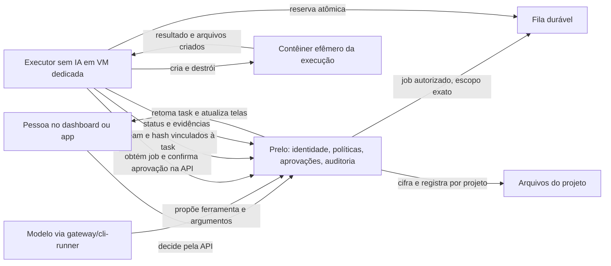

# Plano de arquitetura — execução isolada de tasks

**Estado:** implementação inicial em andamento, baseada nas propostas P-2, P-3 e P-4 aceitas pelo dono; não altera `CONTRATOS.md` nem concede novas permissões fora deste fluxo.
**Princípio:** a máquina principal do Prelo não executa código solicitado por modelos. Cada execução recebe um ambiente efêmero numa VM dedicada a workers, sem acesso à infraestrutura que decide permissões.

**Fatias de configuração e política:** a Caixa de ferramentas lista o catálogo curado e permite ao ADMIN global bloquear/reabilitar ferramentas por projeto. O servidor aplica o bloqueio antes de expor uma ferramenta ao modelo, ao invocá-la e ao decidir uma aprovação pendente. As alterações são versionadas e auditadas em `project_tool_setting_events`. O papel `PROJECT_ADMIN` é atribuído somente por ADMIN global. A execução do worker permanece desligada por padrão.

**Workers:** `executor_workers` registra uma identidade por projeto, vinculada a um digest de imagem. Apenas ADMIN global com sessão humana cria, lista ou revoga o cadastro. O token aleatório é entregue uma vez e só seu hash é persistido. O worker Go separado envia heartbeat autenticado por HTTPS; runtime e claim são opt-in. A Caixa de ferramentas mostra o estado derivado do heartbeat (desabilitado, sem worker recente ou conectado). O worker não foi incluído no compose da máquina principal.

**Fatias de worker e publicação já codificadas:** existe registro de workers por projeto, credencial aleatória armazenada somente como hash, heartbeat, fila durável, decisão administrativa, lease de job, consulta GET atual antes da operação, resultado sequenciado e upload idempotente de arquivos vinculados a task/execução. O worker implementa o cliente desses endpoints e o adaptador Podman com imagem por digest, rede desligada, raiz somente leitura e sem volumes do host. Todas as ferramentas do workspace começam desabilitadas. `PRELO_EXECUTOR_ENABLED=true` habilita as rotas de execução; o processo do worker exige `PRELO_WORKER_ENABLE_RUNTIME=true` e imagem fixada por digest. Ambos ficam desligados sem configuração.

**Limite funcional desta fatia:** as APIs de pedido e aprovação do executor estão separadas das aprovações genéricas de ferramenta. O ciclo `RunAgentLoopUseCase` ainda não converte automaticamente uma chamada de ferramenta do modelo em `executor_request`, nem retoma a task quando o job remoto termina. Assim, o worker, a fila e a publicação já têm implementação de servidor, mas uma task originada pelo modelo ainda não consegue percorrer esse caminho ponta a ponta. Essa integração com o ciclo da task é o próximo slice de código; não deve ser confundida com validação da VM.

A VM dedicada ainda será provisionada pelo dono. O perfil Podman, namespaces, LSM, rede e quotas precisam de validação nela; os testes locais de comandos/adaptadores não provam isolamento real do kernel.

Nesta fatia, `GET` exige sessão humana membro do projeto (ou ADMIN global); `PUT` exige ADMIN global humano. `PUT` devolve `{enabled, version}` e responde `409 concurrent_modification` quando a versão esperada estiver desatualizada. A ausência de override preserva o comportamento das ferramentas existentes (`enabled=true`, `version=0`). A versão da política é gravada em cada `tool_call`: uma aprovação pendente só pode executar se a versão atual ainda for exatamente a mesma, inclusive após bloquear e reabilitar. Esta configuração não acrescenta ferramentas, agentes, workers ou permissões novas.

## 1. Base existente e lacuna

| Peça | Estado no código | Consequência |
| --- | --- | --- |
| `RunAgentLoopUseCase` | Oferece ferramentas do catálogo e suspende a execução ao pedir aprovação | Reaproveitar o pedido, o ledger e a retomada |
| `PermissionPolicy` e `ApprovalRequest` | Decidem por chamada; risco MODERATE/HIGH exige decisão humana | Continuam sendo a autoridade; habilitar uma ferramenta nunca aprova seu uso |
| `DecideApprovalUseCase` | Após aprovação, executa `ToolExecutor` no processo do `prelo-core` | Precisa de caminho assíncrono para ferramentas remotas; não rodar shell ou filesystem aqui |
| `cli-runner` | CLI em modo somente leitura, sem ferramentas próprias; serve ao gateway como modelo | Mantê-lo sem acesso ao workspace, ao Docker e às chaves do worker |
| `Servers` | Cadastro por SSH para consulta e health-check, com chave cifrada | Não usar esse cadastro nem sua chave para criar contêineres |
| Dashboard | Lista de aprovações e servidores; `GET /api/v1/tools` lista nome, descrição e risco | Falta configuração administrativa de capacidades e destinos de execução |
| Arquivos do projeto | `FilesPanel` lista `GET /api/v1/projects/{projectId}/files`; `ProjectFileService` cifra os bytes em repouso (limite de 100 MB por arquivo) | Reaproveitar este armazenamento como destino de publicação dos arquivos criados pela task |

`COMPLETED` hoje pode significar apenas que o modelo respondeu. Uma task que pede um efeito externo só deve ser anunciada como realizada quando houver resultado verificável da ferramenta. Respostas textuais que dizem “execute este comando” não são evidência de execução nem originam aprovação.

## 2. Fronteiras de confiança



- **Plano de controle:** `prelo-core`, banco de políticas e aprovações, bridge e dashboard ficam na infraestrutura principal. O modelo recebe apenas descrições de ferramentas, nunca credenciais administrativas, acesso ao banco, shell do Prelo ou permissão para configurar a própria política.
- **Plano de execução:** serviço sem IA instalado em VM dedicada, autenticado como worker. Um contêiner novo por execução de task; diretório de trabalho e identidade de processo distintos para cada par usuário/task. O mesmo contêiner permanece durante as interações autorizadas daquela execução, para o modelo conseguir listar, criar e conferir arquivos em turnos sucessivos. Nenhum volume de outro usuário ou task é reutilizado. Aprovações adicionais dentro da mesma task não ampliam automaticamente o escopo das anteriores.
- **Máquina principal:** não é destino elegível. Não monta `~/projects`, `.env`, chaves, banco, Docker socket ou diretórios do Prelo na VM/contêiner da task. Rede da VM separada; acesso só aos endpoints mínimos de retirada de jobs e envio de resultados. A API do Prelo nunca aceita `hostPath` arbitrário pedido pelo modelo.
- **Registro de workers:** separado do cadastro SSH de `Servers`. O administrador global cadastra workers e define imagens, quotas e projetos elegíveis. O administrador de um projeto pode escolher apenas entre workers já autorizados globalmente para seu projeto. O agente não escolhe uma VM por nome; solicita uma capacidade e o Prelo seleciona um worker elegível. A VM ainda será criada pelo dono; seu endereço, runtime e credenciais ficam pendentes de provisionamento, não bloqueiam o desenho do contrato.
- **Destino dos arquivos:** o projeto da task é obrigatório para operações de arquivo. Cada arquivo criado com sucesso precisa aparecer na seção **Arquivos** daquele `projectId`, por exemplo `/projetos/c55a2b2d-4ea5-4d28-a06b-b925dd5eac90/arquivos` quando essa for a task do projeto citado. A URL identifica a tela; os bytes vão para o armazenamento cifrado do Prelo, não para esse caminho no host. O worker não escolhe nem substitui o `projectId`.

Contêineres partilham o kernel da VM do worker. Essa VM é a barreira frente ao host principal. Para execução de código arbitrário ou multitenancy hostil, a etapa posterior deve avaliar microVM por task; não tratar isolamento por contêiner como equivalente a uma VM.

## 3. Autorização em duas camadas

1. **Disponibilidade administrativa:** o catálogo curado define as ferramentas existentes. Uma política versionada por projeto limita o que pode ser solicitado. Nesta implementação, somente ADMIN global altera a política e atribui `PROJECT_ADMIN`; administradores de projeto ainda não podem editar configurações nem selecionar workers. O padrão das ferramentas remotas é desabilitado. Nenhuma ferramenta do agente expõe endpoints administrativos.
2. **Aprovação da ação:** para iniciar um contêiner e para **cada operação** pedida ao executor, inclusive leitura/listagem na validação inicial, o Prelo persiste a chamada e uma aprovação com operação, argumentos completos, projeto, task, usuário solicitante, worker permitido, imagem por digest, impacto, expiração e hash canônico. Apenas o administrador global ou um administrador do projeto correspondente pode aprovar, pela **API do Prelo**; WhatsApp/app/dashboard são interfaces dessa API, conforme a identidade do aprovador. `approvals:decide` de um OPERATOR atual não basta para aprovar ações do executor. Permissão para ver ou habilitar uma ferramenta não substitui esta aprovação. Cada operação nova exige outro pedido, ainda que use o mesmo contêiner.

O worker valida uma autorização de uso único emitida pelo Prelo **e consulta o estado atual da aprovação pela API antes de executar**. Ela vincula `jobId`, `toolCallId`, `approvalId`, `taskId`, `executionId`, `projectId`, `userId`, `operation`, `argsHash`, `workerId`, `imageDigest`, `expiresAt`, `nonce` e `policyVersion`. A reserva do nonce/job é atômica e idempotente; decisão negada, expirada, revogada, política alterada, divergência ou API indisponível deixam o job sem execução. A autorização tem audiência exclusiva do worker e vida curta. O worker nunca usa um `approved: true` enviado pelo modelo como prova.

**Contrato aceito pelo dono (P-2/P-3):** a implementação usa `executor_requests` e `executor_jobs` próprios, sem reutilizar `action-requests` de deploy. Há hash SHA-256 do payload JSON canônico, janela de início de cinco minutos, lease de 120 segundos e confirmação GET antes da execução. Falhas de rede e divergências bloqueiam o worker.

## 4. Execução e confinamento

- Primeira versão com operações estruturadas `workspace_list`, `workspace_read`, `workspace_mkdir` e `workspace_create_file`, com caminhos relativos ao workspace efêmero da task. O modelo pode iterar: observar estado → pedir ação → aguardar aprovação → receber resultado → observar de novo. Cada chamada passa pela API de aprovação. Não há comando shell genérico, Dockerfile do modelo, script arbitrário, bind mount ou acesso direto ao host. Coder autônomo fica para outra fase.
- Imagem por digest de uma lista aprovada; runtime rootless quando viável, usuário sem privilégios, `no-new-privileges`, capacidades removidas, root filesystem somente leitura, diretório de trabalho separado, `/tmp` em tmpfs e perfil seccomp/LSM. Sem socket Docker/Podman, modo privilegiado, dispositivos, namespaces do host ou credenciais do plano de controle.
- Quotas por task e usuário: CPU, memória, PIDs, disco, tempo, tamanho de saída, quantidade de contêineres concorrentes e limite de artefatos. Rede desligada por padrão; dependências externas só por serviço de egress específico, com destinos aprovados e credenciais temporárias fora do prompt.
- Paths passam por resolução segura sob a raiz autorizada; negar absoluto, `..`, symlinks que escapem, hardlinks indevidos, caracteres de controle e colisões. A checagem deve operar sobre descritores/raiz do workspace para resistir a troca de symlink entre validação e uso.
- Resultado inclui código, estado, hash dos arquivos, limites atingidos e IDs de correlação. Saída é dado não confiável: tamanho limitado, segredo filtrado e nunca interpretado como nova permissão. O Prelo só conclui uma criação depois de receber, validar e persistir o arquivo no projeto; timeout/crash/falha na publicação produzem erro observável. Cleanup é idempotente, inclusive após queda do worker.
- `~/projects` do dono **não** fica montado no contêiner. O arquivo nasce no workspace isolado, para o modelo conseguir conferi-lo; o worker envia os bytes por streaming ao Prelo, que os cifra e registra nos **Arquivos do projeto**. Para o usuário, o arquivo criado aparece naquela tela. Isso não significa copiá-lo para o disco do host ou exigir um download manual. O workspace temporário pode ser destruído depois que a task terminar e todos os arquivos forem publicados.

### Publicação no projeto: ajuste de contrato necessário

O upload atual (`POST /api/v1/projects/{projectId}/files`) recebe `multipart/form-data` de uma pessoa autenticada, usa `uploadedBy` da sessão, cria um ID novo a cada chamada e reduz o nome ao basename. A lista atual é plana. **Não usar a credencial de uma pessoa no worker** e não fingir que `pasta/arquivo.txt` será preservado pelo upload existente.

Propor uma ingestão interna autenticada para o worker, implementada no `prelo-core` sobre `ProjectFileService`/filestore existentes. O Prelo deriva `projectId`, `taskId`, `executionId`, `toolCallId` e a operação aprovada dos seus registros; confere tamanho, hash e caminho relativo recebido; atribui origem `prelo:task:<taskId>`; publica de forma idempotente, vinculando o arquivo à execução. O worker nunca recebe a chave de cifragem nem um token humano de `files:write`. O status de criação só é `SUCCEEDED` depois do commit do arquivo no projeto. Falha de publicação não pode resultar em task `COMPLETED` como se o arquivo estivesse disponível.

P-4 já adicionou `relativePath`, origem task/execução e vínculo com `executor_request` à metadata dos arquivos; a tela Arquivos exibe o caminho. O endpoint do worker limita cada conteúdo a 64 KiB nesta fatia e exige igualdade com bytes/hash aprovados. Não há ainda quota agregada por task/projeto, histórico de revisões por caminho ou publicação de diretórios vazios.

## 5. Dashboard — “Caixa de ferramentas”

Manter a identidade editorial do dashboard (papel/noturno, recortes, carimbos e tipografia existentes). A interface descreve a política que o servidor devolveu; switches locais não são fonte de autorização.

```text
CAIXA DE FERRAMENTAS                                  Projeto: Loja Aurora
───────────────────────────────────────────────────────────────────────────
Disponíveis ao modelo        Destinos autorizados       Aguardando aprovação
  2 de 8                     1 VM de execução            1 ação

┌ workspace_create_file ───────────┐  ┌ VM de execução ────────────────┐
│ ALTERA ARQUIVOS · EXIGE APROVAÇÃO │  │ worker-01 · SAUDÁVEL           │
│ Agente: Geral                     │  │ Projeto: Loja Aurora           │
│ Espaço: arquivos do projeto       │  │ Imagens: 1 digest aprovado     │
│ [Habilitada para solicitar]       │  │ Rede: desligada                │
└───────────────────────────────────┘  └────────────────────────────────┘

Pedido #...  criar `relatorio.txt` na task ...
Escopo, destino, hash, prazo e impacto → [Negar] [Aprovar pela API]
```

Três vistas: **Catálogo** (nome, risco, efeito, agente/projeto habilitados, versão da política); **Workers** (saúde, quotas, projetos permitidos, imagem e isolamento, sem chave SSH); **Pedidos e execuções** (argumentos exatos, hash, quem aprovou, prazo, status, operações e trilha de auditoria). O administrador global vê toda a instalação; o administrador de projeto vê e configura apenas o próprio projeto dentro dos limites globais. Ao mudar habilitação, mostrar a diferença de política e pedir confirmação humana. Ao aprovar uma ação, mostrar separadamente o que *vai rodar agora*. Não prometer “WhatsApp enviado” sem confirmação de enfileiramento pelo bridge.

APIs **propostas**, sujeitas a contrato: leitura do catálogo e da política efetiva; edição administrativa versionada com `If-Match`; cadastro/saúde de workers; criação/consulta de jobs; reserva/consulta de autorização pelo worker; reporte idempotente de resultado. `GET /api/v1/tools` existente pode abastecer parte da leitura, mas sua resposta atual não traz habilitação, destino nem política efetiva. Novos scopes administrativos não devem ser confundidos com `tools:invoke` ou `servers:manage` atuais.

## 6. Fatias de implementação e critérios de aceite

| Fatia | Entrega | Prova mínima |
| --- | --- | --- |
| E0 — Contrato e ameaça | ADR/contrato novos, modelo de ameaça, papel de administrador de projeto, operações iniciais, autorização e publicação idempotente em Arquivos | Revisão do dono; nenhum endpoint congelado muda implicitamente |
| E1 — Política e caixa de ferramentas | Catálogo efetivo por agente/projeto, teto global, API administrativa versionada, tela de leitura e edição | Operador/modelo não muda política; admin de projeto não amplia teto; concorrência/revogação falham fechadas |
| E2 — Executor sem IA | Worker em VM dedicada, identidade própria, fila durável, reserva única, contêiner por task, rede negada, quotas | Sem acesso à máquina principal, sem Docker socket no task container, crash/retry sem duplicação |
| E3 — Iteração mínima | Aprovar início do contêiner; listar, ler, criar pasta/arquivo no mesmo workspace em turnos sucessivos, cada operação aprovada separadamente; publicar cada arquivo no projeto | PENDING/DENIED/EXPIRED/revogação/timeout não executam; modelo observa arquivo recém-criado; usuário o vê em Arquivos do projeto; replay não duplica |
| E4 — Observabilidade | Aprovação passa a agendar job, execução suspensa retoma só com resultado confirmado; tela de pedidos | Nenhuma task aparece como ação concluída só porque o modelo sugeriu um comando |
| E5 — Futuro | Exportação opcional e coder autônomo em etapa própria; avaliar microVM para código arbitrário | Contrato e revisão de isolamento antes de habilitar execução livre |

**Fora da primeira versão:** shell irrestrito, login SSH do agente, escolha livre de VM, montagens do host, deploy direto e alteração de imagens/políticas pelo modelo. O deploy continua pelo BastionDeploy e pelo contrato próprio de `action-requests`.

## 7. Decisões registradas e próximo passo

1. O dono criará a VM dedicada depois. Instalar e habilitar o runtime depende dessa VM; endpoints, worker, imagem-helper, interface administrativa e armazenamento de arquivos já podem ser desenvolvidos antes dela.
2. O modelo interage com arquivos **dentro do contêiner**, e cada arquivo criado é publicado automaticamente em **Arquivos do projeto**. Nenhum download manual ou exportação para o host é necessário.
3. O administrador global e o administrador do projeto podem habilitar ferramentas e aprovar ações, dentro dos seus respectivos limites; a política global só pode ser administrada pelo primeiro. O novo papel e os scopes exigem contrato explícito.
4. A validação inclui várias operações aprovadas no mesmo contêiner de task. Coder autônomo, shell livre e execução de código do projeto são fases futuras.

O próximo trabalho é detalhar e aprovar o contrato E0, depois implementar E1 e o worker local falso. Até lá, o Prelo deve continuar recusando operações de filesystem/processo. Não conceder escrita ao `cli-runner` como atalho.
